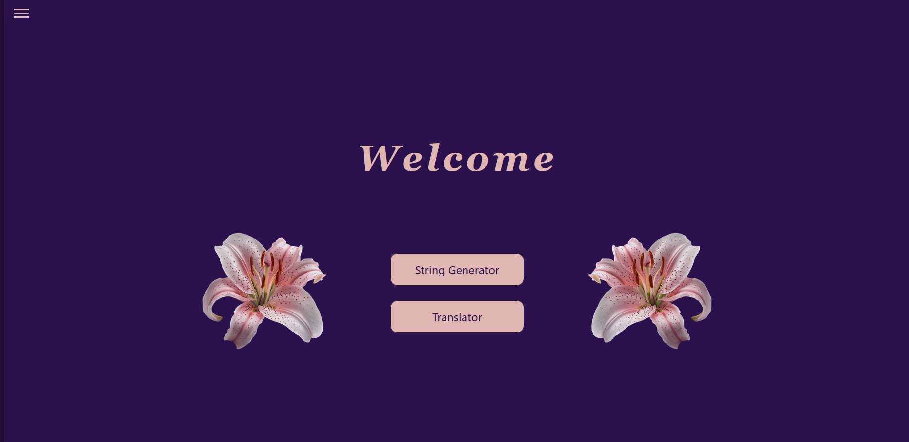
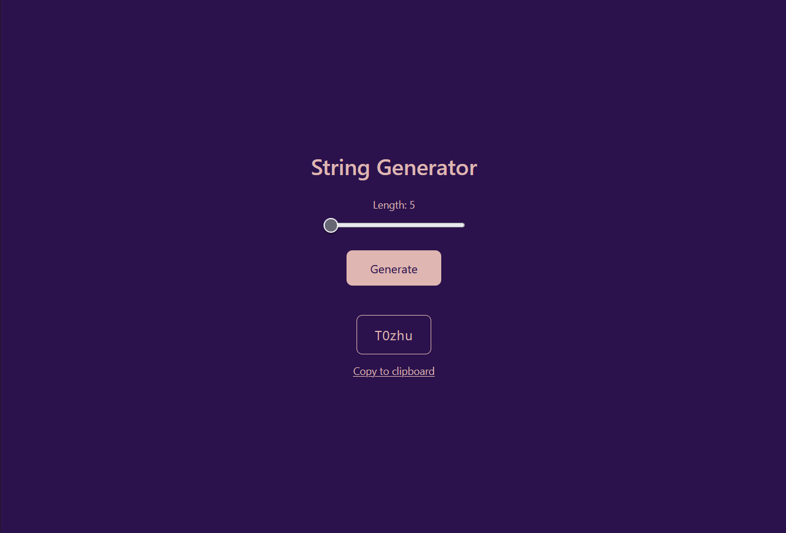

# Slab 1 Frontend Project

A React-based frontend application developed as part of the Slab 1 requirement.  
This project demonstrates clean UI design, React fundamentals, and real-world API integration.

---

## ✨ Features

### 🧵 String Generator
- Generates random alphanumeric strings
- User can control the length of the string
- Copy-to-clipboard functionality
- Built using React hooks (`useState`)

### 🌍 Translator
- Translates text between multiple languages
- Uses a public translation API
- Includes loading and error handling
- Built using `async/await` and `fetch`

---

## 🛠️ Tech Stack

- React (Vite)
- Tailwind CSS
- JavaScript (ES6+)
- Public Translation API

---

## 🚀 Getting Started

### Clone the repository
```bash
git clone <your-repository-url>
```
Install dependencies:
npm install

Run the project:
npm run dev


The app runs locally on:

[http://localhost:5174](http://localhost:5174)


#### 📚 What I Learned

- React basics
- State management
- API handling

#### 👩‍💻 Author

Sameeksha

#### 📌 Notes

This project was built for learning purposes.

## 📸 Screenshots

### Home Page


### String Generator


### Translator


